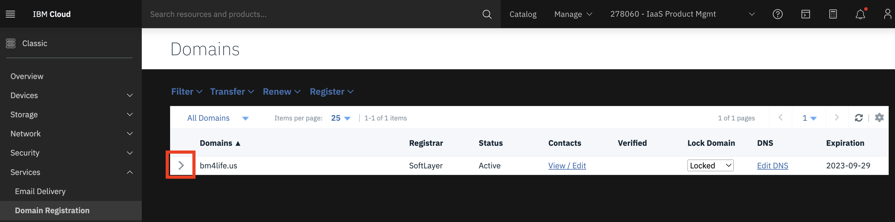
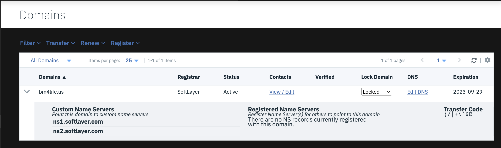

---

copyright:
  years: 1994, 2023
lastupdated: "2023-02-07"

keywords:

subcollection: dns

---

{{site.data.keyword.attribute-definition-list}}

# Managing custom name servers for a domain
{: #add-edit-or-delete-custom-name-servers-for-a-domain}
{: help}
{: support}

Domains running on the {{site.data.keyword.cloud}} network can point to a maximum of five (5) custom name servers. Custom name servers can be added, deleted, or changed at any time. Follow these steps to add, edit, or delete custom name servers for a domain.
{: shortdesc}

1. From your browser, open the [{{site.data.keyword.cloud}} console](https://{DomainName}/){: external} and log in to your account.
1. Select the Menu icon , then click **Classic Infrastructure**.
1. From the Classic Infrastructure menu, select **Services > Domain Registration** to open the Domains page.
1. Select the **Domain Name** to expand the domain into its snapshot view.
1. Select **Unlocked** from the **Lock Domain**.
1. Click the `>` character to expand the domain and configure name servers.
    {: caption="Figure 1. Domains page with the domain collapsed" caption-side="bottom}
    {: caption="Figure 2. Domains page with the domain expanded" caption-side="bottom}
1. Select the **Add/Edit NS** option in the **Custom Name Servers** section of the page. A dialog appears.
1. To complete the appropriate action based on the task, refer to one of the following bullets:
    * To add a custom name server, enter the hostname for the name server in the empty field.
    * To delete a custom name server, delete the information from the field for the appropriate name server.
    * To edit a custom name server, edit the details in the corresponding field for the appropriate name server.
1. Click the **Associate** button to save the changes, or click **Cancel** to cancel the action.

## Next steps
{: #add-edit-or-delete-custom-name-servers-for-a-domain-next}

After you update the name server details, they appear under the **Custom Name Servers** section of the domain. You can update the details at any time.
