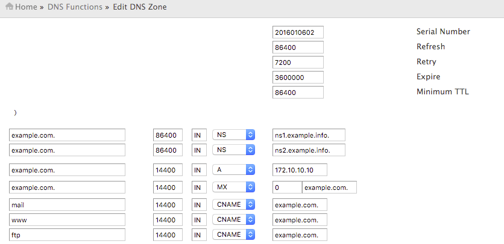

---

copyright:
  years: 1994, 2017-2019
lastupdated: "2019-03-08"

keywords: Record points, Example DNS configurations, CNAME Record points

subcollection: dns

---

{:shortdesc: .shortdesc}
{:new_window: target="_blank"}

# Beispiele für DNS-Konfigurationen
{:#example-dns-configurations-for-reference}

Die folgenden Beispiele zeigen häufig verwendete DNS-Konfigurationen. Dabei ist Folgendes zu beachten:

 * Das Symbol `@` ist ein Kürzel, das die Domäne bezeichnet.
 * Der `A-Datensatz` verweist von einem `Hostnamen` (z. B. `domain.com` oder `sub.domain.com`) auf eine IP-Adresse (z. B. 123.123.231.1).
 * Der `CNAME-Datensatz` verweist von einem `Hostnamen` (z. B. `domain.com` oder `sub.domain.com`) auf einen anderen `Hostnamen`.

## Im IBM Cloud-Kundenportal
{:#ibm-cloud-customer-portal-example}

## In cPanel
{:#cpanel-example}

## In Plesk
{:#plesk-example}

