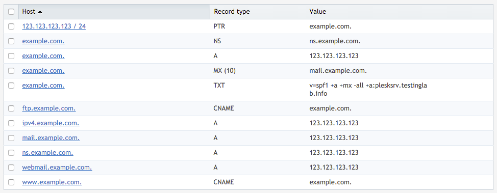

---

copyright:
  years: 1994, 2017-2019
lastupdated: "2019-03-08"

keywords: Record points, Example DNS configurations, CNAME Record points

subcollection: dns

---

{:shortdesc: .shortdesc}
{:new_window: target="_blank"}

# 供参考的示例 DNS 配置
{:#example-dns-configurations-for-reference}

以下图像显示了一些常见 DNS 设置。要记住的事项：

 * `@` 符号是对域本身的缩写。
 * `A 记录`用于将 `hostname`（例如，`domain.com` 或 `sub.domain.com`）指向 IP 地址（例如，123.123.231.1）。
 * `CNAME 记录`用于将 `hostname`（例如，`domain.com` 或 `sub.domain.com`）指向另一个 `hostname`。

## 在 IBM Cloud 客户门户网站中
{:#ibm-cloud-customer-portal-example}

## 在 cPanel 中
{:#cpanel-example}

## 在 Plesk 中
{:#plesk-example}

