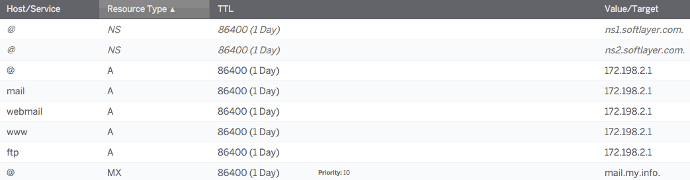

---
copyright:
  years: 1994, 2017
lastupdated: "2017-11-29"
---

{:shortdesc: .shortdesc}
{:new_window: target="_blank"}

# 參照的範例 DNS 配置

下列影像顯示一些常見的 DNS 設定。注意事項：

 * `@` 符號是網域本身的速記。
 * `A Record` 從 `hostname`（例如 `domain.com` 或 `sub.domain.com`）指向 IP 位址（例如 123.123.231.1）。
 * `CNAME Record` 從 `hostname`（例如 `domain.com` 或 `sub.domain.com`）指向另一個 `hostname`。

## 在 IBM Cloud 客戶入口網站中

## 在 cPanel 中

## 在 Plesk 中

